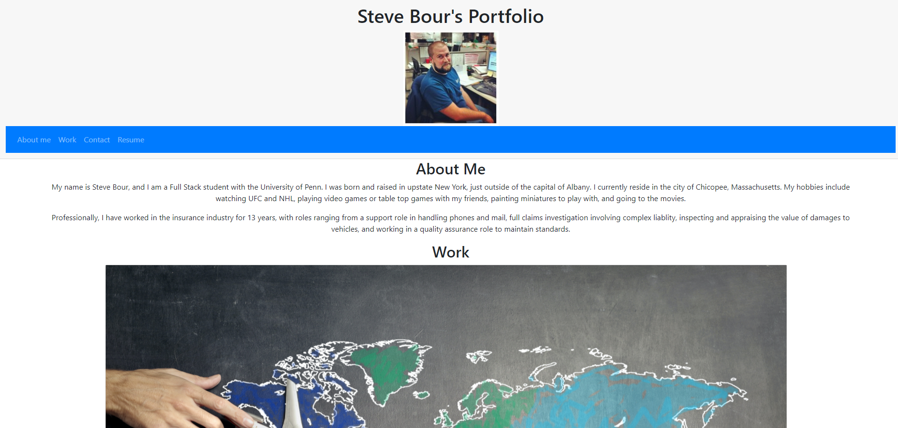

# Bour Portfolio
  
  
  ## Description
  
  A portfolio giving a short bio about me, a list of exemplary projects and homeworks completed, along with contact info and a copy of my Resume.
  
  ## Table of Contents 
  
  * [Installation](#installation)
  
  * [Usage](#usage)
  
  * [Contributing](#contributing)
  
  * [Tests](#tests)
  
  * [Questions](#questions)
  
  ## Installation
  
  To install necessary dependencies, run the following command:
  
  ```
  none
  ```
  
  ## Usage

  https://sbour1.github.io/Bour-portfolio
  
  nothing
  
  
    
  ## Contributing
  
  nothing
  
  ## Tests
  
  To run tests, run the following command:
  
  ```
  nothing
  ```
  
  ## Questions
  
  If you have any questions about the repo, open an issue or contact me directly at bourpower@gmail.com. You can find more of my work at [Sbour1](https://github.com/Sbour1/).
  
  

